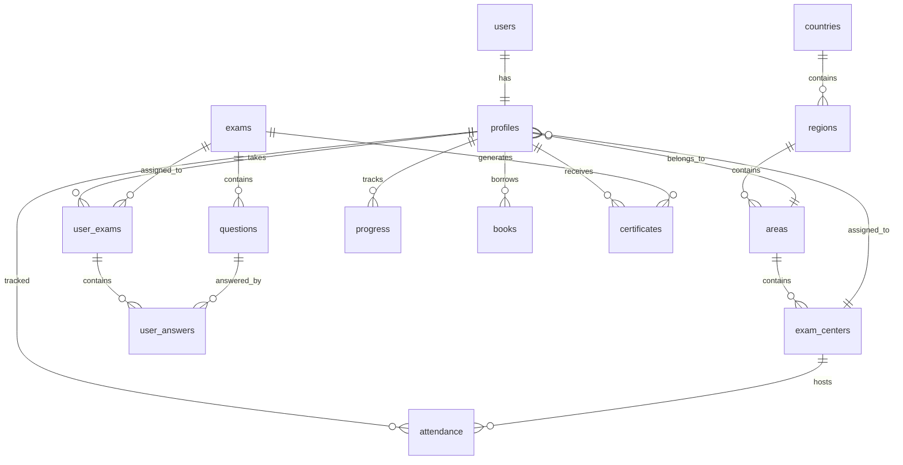

# 🗄️ QHLC Database Setup

This document explains the complete database setup for the QHLC Web Portal.

## 📋 Overview

The QHLC database is built on **Supabase** (PostgreSQL) and includes:

- **16 core tables** for all application features
- **Row Level Security (RLS)** for data protection
- **Sample data** for testing and development
- **Helper functions** for common operations
- **Storage buckets** for file management

## 🚀 Quick Start

### 1. Set Up Supabase Project

1. Go to [https://supabase.com](https://supabase.com)
2. Create a new project named `qhlc-portal`
3. Copy your project URL and API keys

### 2. Configure Environment

```bash
# Copy environment template
cp env.example .env.local

# Edit .env.local with your Supabase credentials
NEXT_PUBLIC_SUPABASE_URL=https://your-project.supabase.co
NEXT_PUBLIC_SUPABASE_ANON_KEY=your-anon-key
SUPABASE_SERVICE_ROLE_KEY=your-service-role-key
```

### 3. Run Database Setup

1. Open Supabase SQL Editor
2. Copy and paste the content from `scripts/setup-database.sql`
3. Click "Run" to execute

### 4. Verify Setup

```bash
npm run verify-setup
```

## 📊 Database Schema

### Core Tables

| Table | Purpose | Key Features |
|-------|---------|--------------|
| `profiles` | User profiles | Extends Supabase auth, role-based access |
| `countries` | Geographic data | Country hierarchy |
| `regions` | Geographic data | Region hierarchy |
| `areas` | Geographic data | Area hierarchy |
| `exam_centers` | Exam locations | Contact info, capacity |
| `exams` | Exam management | Duration, marks, scheduling |
| `questions` | Exam questions | MCQ, text, true/false |
| `user_exams` | Exam attempts | Progress tracking |
| `user_answers` | User responses | Auto-evaluation |
| `attendance` | Attendance tracking | Present/absent/late |
| `progress` | Learning progress | Surah/ayah tracking |
| `books` | Book management | Issue/return tracking |
| `resources` | File management | PDFs, videos, etc. |
| `gallery` | Image gallery | Public images |
| `certificates` | Certificates | Auto-generated PDFs |
| `notifications` | User notifications | In-app messaging |

### Relationships



## 🔐 Security Features

### Row Level Security (RLS)

All tables have RLS enabled with appropriate policies:

- **Users** can only access their own data
- **Admins** can access all data
- **Public resources** are viewable by everyone
- **Private data** is protected by user ID

### Authentication

- **Supabase Auth** for user management
- **JWT tokens** for session management
- **Email verification** for new accounts
- **Password reset** functionality

### Data Protection

- **Encrypted connections** (HTTPS)
- **Secure API keys** management
- **Audit logging** for admin actions
- **Backup and recovery** via Supabase

## 🛠 Helper Functions

### `generate_serial_number()`
- Auto-generates `QHLC-XXXXX` serial numbers
- Triggered on profile creation
- Ensures unique identification

### `get_user_profile(user_uuid)`
- Returns user profile with role information
- Used for dashboard access control
- Includes all profile fields

### `get_user_dashboard_stats(user_uuid)`
- Returns dashboard statistics
- Total exams, certificates, study hours
- Progress percentage calculation

## 📁 Storage Buckets

| Bucket | Purpose | Access |
|--------|---------|--------|
| `certificates` | Exam certificates | Private |
| `gallery` | Public images | Public |
| `resources` | Study materials | Private |
| `profiles` | Profile images | Private |

## 🧪 Sample Data

The setup includes sample data for testing:

### Geographic Data
- **1 Country**: Saudi Arabia
- **3 Regions**: Riyadh, Makkah, Eastern Province
- **6 Areas**: Major cities in each region
- **3 Exam Centers**: With contact information

### Sample Structure
```
Saudi Arabia
├── Riyadh Region
│   ├── Riyadh City → QHLC Riyadh Main Center
│   └── Al Kharj
├── Makkah Region
│   ├── Makkah City → QHLC Makkah Center
│   └── Jeddah
└── Eastern Province
    ├── Dammam → QHLC Dammam Center
    └── Al Khobar
```

## 🔧 Development Workflow

### Adding New Data

1. **Geographic Data**
   ```sql
   INSERT INTO regions (country_id, name, code) VALUES 
   ((SELECT id FROM countries WHERE code = 'SA'), 'New Region', 'NEW');
   ```

2. **Exam Centers**
   ```sql
   INSERT INTO exam_centers (area_id, name, address) VALUES 
   ((SELECT id FROM areas WHERE code = 'AREA-CODE'), 'Center Name', 'Address');
   ```

3. **Exams**
   ```sql
   INSERT INTO exams (title, description, duration, total_marks, passing_marks, exam_type, start_date, end_date) VALUES 
   ('Exam Title', 'Description', 60, 100, 70, 'regular', '2024-01-01', '2024-12-31');
   ```

### Testing

```bash
# Verify database setup
npm run verify-setup

# Check specific tables
npm run verify-setup -- --table=profiles

# Test connections
npm run verify-setup -- --connection-only
```

## 🚨 Troubleshooting

### Common Issues

1. **"Table not found"**
   - Run the setup script again
   - Check SQL Editor for errors

2. **"Permission denied"**
   - Verify RLS policies are created
   - Check user authentication

3. **"Connection failed"**
   - Verify environment variables
   - Check Supabase project status

4. **"Storage bucket missing"**
   - Run the setup script again
   - Check storage permissions

### Debug Commands

```bash
# Check environment variables
node -e "console.log(require('dotenv').config({path: '.env.local'}))"

# Test Supabase connection
node -e "
const { createClient } = require('@supabase/supabase-js');
require('dotenv').config({path: '.env.local'});
const supabase = createClient(process.env.NEXT_PUBLIC_SUPABASE_URL, process.env.NEXT_PUBLIC_SUPABASE_ANON_KEY);
supabase.from('countries').select('*').then(console.log);
"
```

## 📈 Performance

### Indexes
- **Primary keys** on all tables
- **Foreign key indexes** for relationships
- **User-specific indexes** for queries
- **Status indexes** for filtering

### Optimization
- **Connection pooling** via Supabase
- **Query optimization** with proper indexes
- **Caching** for frequently accessed data
- **Lazy loading** for large datasets

## 🔄 Migration Strategy

### Schema Changes
1. Create migration script
2. Test in development
3. Apply to staging
4. Deploy to production

### Data Migration
1. Export current data
2. Transform as needed
3. Import to new schema
4. Verify integrity

## 📚 Resources

- [Supabase Documentation](https://supabase.com/docs)
- [PostgreSQL Documentation](https://www.postgresql.org/docs/)
- [RLS Best Practices](https://supabase.com/docs/guides/auth/row-level-security)
- [Database Design Patterns](https://supabase.com/docs/guides/database/design-patterns)

## 🤝 Support

If you encounter issues:

1. Check the troubleshooting section
2. Run the verification script
3. Review Supabase logs
4. Create an issue with details

---

**Last Updated**: 2024-12-28  
**Version**: 1.0.0 