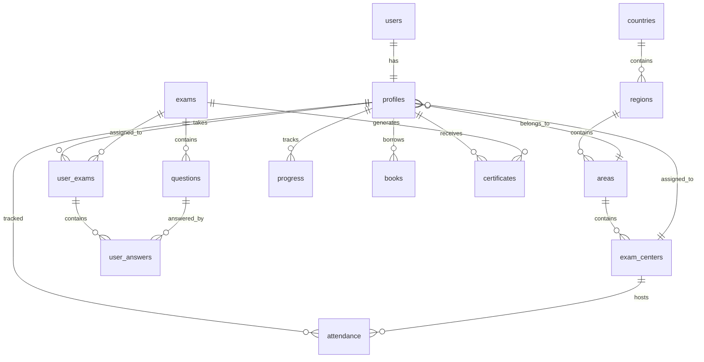

# 📘 QHLC Web Portal (KSA) — Developer Documentation

**Version:** 0.1  
**Date:** 2025-06-28  
**Prepared By:** Eejaz Ishaq

---

## 🧭 Table of Contents

1. [Project Overview](#1-project-overview)  
2. [Technology Stack](#2-technology-stack)  
3. [System Architecture](#3-system-architecture)  
4. [User Roles & Access Levels](#4-user-roles--access-levels)  
5. [App Flow](#5-app-flow)  
6. [Modules & Pages](#6-modules--pages)  
7. [Registration Flow](#7-registration-flow)  
8. [Database Structure](#8-database-structure)  
9. [Authentication & Security](#9-authentication--security)  
10. [UI/UX Design Conventions](#10-uiux-design-conventions)  
11. [Deployment Plan](#11-deployment-plan)  
12. [Non-Functional Requirements](#12-non-functional-requirements)  

---

## 1. 📖 Project Overview

QHLC Web Portal is a country-wide web platform for Quranic learning and exam management in Saudi Arabia. It offers:

- Role-based login (User, Coordinator, Convener, Admin)
- Exam registration and evaluation
- Real-time reporting
- Admin tools for content, schedule, and report management
- Arabic/English/Malayalam language support

---

## 2. 🛠 Technology Stack

| Layer         | Technology                         |
|---------------|------------------------------------|
| Frontend      | Next.js, Tailwind CSS              |
| PWA           | Next.js PWA, Workbox               |
| Authentication| Supabase Auth (email/password)     |
| Backend       | Supabase Auto-generated REST APIs  |
| Database      | Supabase PostgreSQL                |
| Storage       | Supabase Buckets                   |
| Hosting       | Vercel or Netlify                  |
| Domain & DNS  | Cloudflare                         |

---

## 3. 🧱 System Architecture

The system follows a modern web architecture with:

- **Frontend**: Next.js application with server-side rendering
- **Backend**: Supabase provides authentication, database, and storage
- **Database**: PostgreSQL with Row-Level Security (RLS)
- **Authentication**: JWT-based sessions via Supabase Auth
- **File Storage**: Supabase Storage buckets for certificates and media
- **Deployment**: Static hosting with serverless functions

---

## 4. 🧑‍💼 User Roles & Access Levels

| Role           | Description                                      |
|----------------|--------------------------------------------------|
| User           | Registers, views profile, takes mock/exams      |
| Coordinator    | Manages attendance, book, and progress           |
| Convener       | Regional center oversight                        |
| Exam Admin     | Exam management, questions, evaluations          |
| Super Admin    | Full system configuration, user/resource control |

---

## 5. 🔄 App Flow

### 🔐 Authentication

- Email/password registration/login via Supabase Auth
- RLS (Row-Level Security) ensures role-based access
- User is redirected based on role after login

### 📇 Role-based Dashboards

- After login, route users to respective dashboards
- Fetch profile data using Supabase client-side session, so user can change their profile details
- Conditionally render components by `user_type`

### 📥 Data Flow

- Public → Registration → Auth SignUp + Profile Entry
- Profile → Inserted with dependent Area/Center selection
- Exams → Auto-assigned or manually scheduled
- Answers → Evaluated by admin or auto-evaluated
- Reports → Generated per role (Coordinator, Convener, Admin)

---

## 6. 📂 Modules & Pages

### 6.1 Public Pages

- `/` - Landing Page
- `/resources` - Static/Downloadable content
- `/gallery` - Image gallery from Supabase bucket
- `/downloads` - PDFs, videos
- `/contact` - Contact form / email trigger
- `/login`, `/register` - Auth pages

### 6.2 User Dashboard (`/dashboard/user`)

- **Dashboard**: Summary of exams, certificates
- **Profile**: View/edit personal details
- **Exam**: Start or schedule exam
- **Mock Exams**: Practice mode
- **Exam History**: Previous results
- **Certificates**: View/download PDFs

### 6.3 Coordinator Dashboard (`/dashboard/coordinator`)

- **Attendance**: Mark/view user presence
- **Progress**: Quran memorization/tracking
- **Books**: Distribute & track book handovers

### 6.4 Convener Dashboard (`/dashboard/convener`)

- **Center Summary**: Overview of all centers in region
- **Reports**: Generate attendance, book, and progress reports

### 6.5 Admin Panel (`/admin`)

- **Users**: Manage users by role and access
- **Question Bank**: Create, edit, delete questions
- **Exam Schedule**: Add exams, assign to users
- **Evaluation**: Review user answers, grade
- **Transfer Tool**: Move users between centers
- **Resources**: Upload PDFs, videos
- **Reports**: Export reports (CSV, PDF)

---

## 7. 📝 Registration Flow

### Adult Registration

| Field            | Required | Notes                        |
|------------------|----------|------------------------------|
| Full Name        | ✅       |                              |
| Mobile           | ✅       | Unique check                 |
| WhatsApp No      | ✅       | Optional                     |
| Gender           | ✅       | Enum (Male/Female)           |
| Area             | ✅       | Selected based on Region     |
| Exam Center      | ✅       | Auto-loaded based on Area    |
| Email            | ✅       | Supabase Auth email          |
| Password         | ✅       | Supabase Auth password       |

### Child Registration (Additional Fields)

| Field           | Required |
|-----------------|----------|
| Father Name     | ✅       |
| Date of Birth   | ✅       |
| Iqama Number    | ✅       |

### Dependent Dropdowns

1. **Country → Region → Area → Exam Center** (linked FK lookups)
2. On registration, profile insert + Supabase user creation
3. Serial number: `QHLC–<5-digit ID>` auto-generated post insert

---

## 8. 🗃️ Database Structure

### Complete Database Schema

#### Core Tables

**`users` (Supabase Auth)**
| Column         | Type      | Description               |
|----------------|-----------|---------------------------|
| id             | UUID      | Primary Key (Supabase)    |
| email          | text      | Unique email address      |
| email_confirmed_at | timestamp | Email verification time |
| created_at     | timestamp | Account creation time     |
| updated_at     | timestamp | Last update time          |

**`profiles`**
| Column         | Type      | Description               |
|----------------|-----------|---------------------------|
| id             | UUID      | FK to `users.id`          |
| full_name      | text      | User's full name          |
| mobile         | text      | Mobile number (unique)    |
| whatsapp_no    | text      | Optional WhatsApp number  |
| gender         | enum      | Male/Female               |
| user_type      | enum      | user/coordinator/convener/admin/super_admin |
| area_id        | UUID      | FK to `areas`             |
| center_id      | UUID      | FK to `exam_centers`      |
| father_name    | text      | For child registration    |
| dob            | date      | Date of birth             |
| iqama_number   | text      | Iqama/ID number           |
| serial_number  | text      | Auto-gen: QHLC-XXXXX      |
| profile_image  | text      | URL to profile image      |
| is_active      | boolean   | Default true              |
| created_at     | timestamp | Default NOW()             |
| updated_at     | timestamp | Default NOW()             |

**`countries`**
| Column         | Type      | Description               |
|----------------|-----------|---------------------------|
| id             | UUID      | Primary Key               |
| name           | text      | Country name              |
| code           | text      | Country code (SA)         |
| is_active      | boolean   | Default true              |

**`regions`**
| Column         | Type      | Description               |
|----------------|-----------|---------------------------|
| id             | UUID      | Primary Key               |
| country_id     | UUID      | FK to `countries`         |
| name           | text      | Region name               |
| code           | text      | Region code               |
| is_active      | boolean   | Default true              |

**`areas`**
| Column         | Type      | Description               |
|----------------|-----------|---------------------------|
| id             | UUID      | Primary Key               |
| region_id      | UUID      | FK to `regions`           |
| name           | text      | Area name                 |
| code           | text      | Area code                 |
| is_active      | boolean   | Default true              |

**`exam_centers`**
| Column         | Type      | Description               |
|----------------|-----------|---------------------------|
| id             | UUID      | Primary Key               |
| area_id        | UUID      | FK to `areas`             |
| name           | text      | Center name               |
| address        | text      | Center address            |
| contact_person | text      | Contact person name       |
| contact_phone  | text      | Contact phone number      |
| capacity       | integer   | Maximum capacity          |
| is_active      | boolean   | Default true              |

#### Exam Management Tables

**`exams`**
| Column         | Type      | Description               |
|----------------|-----------|---------------------------|
| id             | UUID      | Primary Key               |
| title          | text      | Exam title                |
| description    | text      | Exam description          |
| duration       | integer   | Duration in minutes       |
| total_marks    | integer   | Total possible marks      |
| passing_marks  | integer   | Minimum marks to pass     |
| exam_type      | enum      | mock/regular/final        |
| status         | enum      | draft/active/inactive     |
| start_date     | timestamp | Exam start date           |
| end_date       | timestamp | Exam end date             |
| created_by     | UUID      | FK to `profiles`          |
| created_at     | timestamp | Default NOW()             |
| updated_at     | timestamp | Default NOW()             |

**`questions`**
| Column         | Type      | Description               |
|----------------|-----------|---------------------------|
| id             | UUID      | Primary Key               |
| exam_id        | UUID      | FK to `exams`             |
| question_text  | text      | The actual question       |
| options        | JSONB     | Multiple choice options   |
| correct_answer | text      | Correct answer            |
| type           | enum      | mcq/truefalse/text        |
| marks          | integer   | Marks for this question   |
| order_number   | integer   | Question order in exam    |
| created_at     | timestamp | Default NOW()             |

**`user_exams`**
| Column         | Type      | Description               |
|----------------|-----------|---------------------------|
| id             | UUID      | Primary Key               |
| user_id        | UUID      | FK to `profiles`          |
| exam_id        | UUID      | FK to `exams`             |
| started_at     | timestamp | Exam start time           |
| submitted_at   | timestamp | Exam submission time      |
| status         | enum      | pending/completed/evaluated |
| total_score    | integer   | Final score               |
| evaluator_id   | UUID      | FK to evaluator           |
| remarks        | text      | Admin remarks             |
| created_at     | timestamp | Default NOW()             |

**`user_answers`**
| Column         | Type      | Description               |
|----------------|-----------|---------------------------|
| id             | UUID      | Primary Key               |
| user_exam_id   | UUID      | FK to `user_exams`        |
| question_id    | UUID      | FK to `questions`         |
| answer_text    | text      | User's answer             |
| is_correct     | boolean   | Auto-evaluated (MCQs)     |
| score_awarded  | integer   | Marks given               |
| evaluated_by   | UUID      | FK to evaluator           |
| created_at     | timestamp | Default NOW()             |

#### Learning Management Tables

**`attendance`**
| Column         | Type      | Description               |
|----------------|-----------|---------------------------|
| id             | UUID      | Primary Key               |
| user_id        | UUID      | FK to `profiles`          |
| center_id      | UUID      | FK to `exam_centers`      |
| date           | date      | Attendance date           |
| status         | enum      | present/absent/late       |
| marked_by      | UUID      | FK to coordinator         |
| remarks        | text      | Optional remarks          |
| created_at     | timestamp | Default NOW()             |

**`progress`**
| Column         | Type      | Description               |
|----------------|-----------|---------------------------|
| id             | UUID      | Primary Key               |
| user_id        | UUID      | FK to `profiles`          |
| surah_number   | integer   | Surah number (1-114)      |
| ayah_start     | integer   | Starting ayah             |
| ayah_end       | integer   | Ending ayah               |
| status         | enum      | memorized/reviewing/learning |
| notes          | text      | Progress notes            |
| updated_by     | UUID      | FK to coordinator         |
| updated_at     | timestamp | Default NOW()             |

**`books`**
| Column         | Type      | Description               |
|----------------|-----------|---------------------------|
| id             | UUID      | Primary Key               |
| user_id        | UUID      | FK to `profiles`          |
| book_type      | enum      | quran/tafseer/other       |
| title          | text      | Book title                |
| issued_date    | date      | When book was issued      |
| return_date    | date      | Expected return date      |
| returned_date  | date      | Actual return date        |
| status         | enum      | issued/returned/overdue   |
| issued_by      | UUID      | FK to coordinator         |
| created_at     | timestamp | Default NOW()             |

#### Content Management Tables

**`resources`**
| Column         | Type      | Description               |
|----------------|-----------|---------------------------|
| id             | UUID      | Primary Key               |
| title          | text      | Resource title            |
| description    | text      | Resource description      |
| file_url       | text      | File URL in storage       |
| file_type      | enum      | pdf/video/audio/image     |
| file_size      | integer   | File size in bytes        |
| category       | enum      | study/exam/certificate    |
| is_public      | boolean   | Publicly accessible       |
| download_count | integer   | Download counter          |
| uploaded_by    | UUID      | FK to admin               |
| created_at     | timestamp | Default NOW()             |

**`gallery`**
| Column         | Type      | Description               |
|----------------|-----------|---------------------------|
| id             | UUID      | Primary Key               |
| title          | text      | Image title               |
| description    | text      | Image description         |
| image_url      | text      | Image URL in storage      |
| category       | enum      | events/activities/other   |
| is_featured    | boolean   | Featured image            |
| uploaded_by    | UUID      | FK to admin               |
| created_at     | timestamp | Default NOW()             |

**`certificates`**
| Column         | Type      | Description               |
|----------------|-----------|---------------------------|
| id             | UUID      | Primary Key               |
| user_id        | UUID      | FK to `profiles`          |
| exam_id        | UUID      | FK to `exams`             |
| certificate_url| text      | PDF URL in storage        |
| issued_date    | date      | Certificate issue date    |
| issued_by      | UUID      | FK to admin               |
| created_at     | timestamp | Default NOW()             |

#### System Tables

**`audit_logs`**
| Column         | Type      | Description               |
|----------------|-----------|---------------------------|
| id             | UUID      | Primary Key               |
| user_id        | UUID      | FK to `profiles`          |
| action         | text      | Action performed          |
| table_name     | text      | Affected table            |
| record_id      | UUID      | Affected record ID        |
| old_values     | JSONB     | Previous values           |
| new_values     | JSONB     | New values                |
| ip_address     | text      | User's IP address         |
| user_agent     | text      | Browser/device info       |
| created_at     | timestamp | Default NOW()             |

**`notifications`**
| Column         | Type      | Description               |
|----------------|-----------|---------------------------|
| id             | UUID      | Primary Key               |
| user_id        | UUID      | FK to `profiles`          |
| title          | text      | Notification title        |
| message        | text      | Notification message      |
| type           | enum      | info/warning/error/success |
| is_read        | boolean   | Read status               |
| action_url     | text      | Optional action URL       |
| created_at     | timestamp | Default NOW()             |

### Database Relationships



---

## 8.1 📁 Optimal Folder Structure

```
qhlc/
├── public/
│   ├── icons/                    # PWA icons
│   │   ├── icon-192x192.png
│   │   ├── icon-512x512.png
│   │   └── apple-touch-icon.png
│   ├── images/                   # Static images
│   ├── fonts/                    # Custom fonts
│   └── manifest.json             # PWA manifest
│
├── src/
│   ├── app/                      # Next.js 13+ App Router
│   │   ├── (auth)/               # Auth group routes
│   │   │   ├── login/
│   │   │   │   └── page.tsx
│   │   │   ├── register/
│   │   │   │   └── page.tsx
│   │   │   └── layout.tsx
│   │   │
│   │   ├── (public)/             # Public group routes
│   │   │   ├── page.tsx          # Landing page
│   │   │   ├── resources/
│   │   │   ├── gallery/
│   │   │   ├── downloads/
│   │   │   ├── contact/
│   │   │   └── layout.tsx
│   │   │
│   │   ├── dashboard/            # Dashboard routes
│   │   │   ├── user/             # User dashboard
│   │   │   │   ├── page.tsx
│   │   │   │   ├── profile/
│   │   │   │   ├── exams/
│   │   │   │   ├── mock-exams/
│   │   │   │   ├── history/
│   │   │   │   └── certificates/
│   │   │   │
│   │   │   ├── coordinator/      # Coordinator dashboard
│   │   │   │   ├── page.tsx
│   │   │   │   ├── attendance/
│   │   │   │   ├── progress/
│   │   │   │   └── books/
│   │   │   │
│   │   │   ├── convener/         # Convener dashboard
│   │   │   │   ├── page.tsx
│   │   │   │   ├── centers/
│   │   │   │   └── reports/
│   │   │   │
│   │   │   └── layout.tsx        # Dashboard layout
│   │   │
│   │   ├── admin/                # Admin panel
│   │   │   ├── page.tsx
│   │   │   ├── users/
│   │   │   ├── questions/
│   │   │   ├── exams/
│   │   │   ├── evaluation/
│   │   │   ├── transfer/
│   │   │   ├── resources/
│   │   │   └── reports/
│   │   │
│   │   ├── api/                  # API routes
│   │   │   ├── auth/
│   │   │   ├── users/
│   │   │   ├── exams/
│   │   │   ├── questions/
│   │   │   ├── attendance/
│   │   │   ├── progress/
│   │   │   ├── books/
│   │   │   ├── resources/
│   │   │   ├── gallery/
│   │   │   ├── certificates/
│   │   │   ├── notifications/
│   │   │   └── upload/
│   │   │
│   │   ├── globals.css           # Global styles
│   │   ├── layout.tsx            # Root layout
│   │   └── page.tsx              # Root page
│   │
│   ├── components/               # Reusable components
│   │   ├── ui/                   # Base UI components
│   │   │   ├── Button.tsx
│   │   │   ├── Input.tsx
│   │   │   ├── Modal.tsx
│   │   │   ├── Table.tsx
│   │   │   ├── Card.tsx
│   │   │   ├── Badge.tsx
│   │   │   ├── Loading.tsx
│   │   │   └── index.ts
│   │   │
│   │   ├── forms/                # Form components
│   │   │   ├── LoginForm.tsx
│   │   │   ├── RegisterForm.tsx
│   │   │   ├── ProfileForm.tsx
│   │   │   ├── ExamForm.tsx
│   │   │   └── QuestionForm.tsx
│   │   │
│   │   ├── dashboard/            # Dashboard components
│   │   │   ├── Sidebar.tsx
│   │   │   ├── Header.tsx
│   │   │   ├── StatsCard.tsx
│   │   │   ├── RecentActivity.tsx
│   │   │   └── Navigation.tsx
│   │   │
│   │   ├── exam/                 # Exam components
│   │   │   ├── ExamTimer.tsx
│   │   │   ├── QuestionCard.tsx
│   │   │   ├── AnswerInput.tsx
│   │   │   ├── ProgressBar.tsx
│   │   │   └── ResultCard.tsx
│   │   │
│   │   ├── admin/                # Admin components
│   │   │   ├── UserTable.tsx
│   │   │   ├── QuestionEditor.tsx
│   │   │   ├── ExamScheduler.tsx
│   │   │   ├── EvaluationPanel.tsx
│   │   │   └── ReportGenerator.tsx
│   │   │
│   │   ├── mobile/               # Mobile-specific components
│   │   │   ├── BottomNav.tsx
│   │   │   ├── SwipeableCard.tsx
│   │   │   ├── TouchButton.tsx
│   │   │   └── PullToRefresh.tsx
│   │   │
│   │   └── layout/               # Layout components
│   │       ├── Header.tsx
│   │       ├── Footer.tsx
│   │       ├── Navigation.tsx
│   │       └── Container.tsx
│   │
│   ├── lib/                      # Utility libraries
│   │   ├── supabase/             # Supabase configuration
│   │   │   ├── client.ts
│   │   │   ├── server.ts
│   │   │   ├── auth.ts
│   │   │   └── storage.ts
│   │   │
│   │   ├── utils/                # Utility functions
│   │   │   ├── auth.ts
│   │   │   ├── validation.ts
│   │   │   ├── formatting.ts
│   │   │   ├── constants.ts
│   │   │   └── helpers.ts
│   │   │
│   │   ├── hooks/                # Custom React hooks
│   │   │   ├── useAuth.ts
│   │   │   ├── useSupabase.ts
│   │   │   ├── useLocalStorage.ts
│   │   │   ├── useOffline.ts
│   │   │   └── usePWA.ts
│   │   │
│   │   └── types/                # TypeScript types
│   │       ├── database.ts       # Generated from Supabase
│   │       ├── auth.ts
│   │       ├── api.ts
│   │       └── common.ts
│   │
│   ├── styles/                   # Additional styles
│   │   ├── components.css
│   │   ├── animations.css
│   │   └── themes.css
│   │
│   └── middleware.ts             # Next.js middleware
│
├── docs/                         # Documentation
│   ├── CONTEXT.md
│   ├── API.md
│   ├── DEPLOYMENT.md
│   └── CONTRIBUTING.md
│
├── scripts/                      # Build and deployment scripts
│   ├── build.sh
│   ├── deploy.sh
│   └── backup.sh
│
├── tests/                        # Test files
│   ├── unit/
│   ├── integration/
│   └── e2e/
│
├── .env.local                    # Environment variables
├── .env.example                  # Environment template
├── next.config.js                # Next.js configuration
├── tailwind.config.js            # Tailwind CSS configuration
├── tsconfig.json                 # TypeScript configuration
├── package.json                  # Dependencies
├── README.md                     # Project README
└── vercel.json                   # Vercel configuration
```

### Key Features of This Structure

**📱 Mobile-First Organization:**
- Separate mobile components in `components/mobile/`
- PWA-specific files in `public/`
- Responsive layouts throughout

**🔐 Security & Authentication:**
- Grouped auth routes in `(auth)/`
- Middleware for route protection
- Separate server/client Supabase configs

**🎯 Role-Based Organization:**
- Dashboard routes separated by user type
- Role-specific components
- Conditional rendering based on user type

**📊 Scalable Architecture:**
- Modular component structure
- Reusable UI components
- Type-safe database integration

**🚀 Performance Optimized:**
- Code splitting by route groups
- Lazy loading components
- PWA service worker integration

---

## 9. 🔐 Authentication & Security

- JWT sessions via Supabase Auth
- RLS policies to restrict table access:
  - `profiles`: users can only read/update own profile
  - `user_exams`, `answers`: user-restricted
- Admin role check via `user_type` or claim
- Serial number generation via DB trigger or edge function
- Supabase Storage with signed URLs for certificates/files

---

## 10. 🎨 UI/UX Design Conventions

- **Framework**: Next.js + Tailwind CSS
- **Design**: Clean, responsive layout
- **Theme**: Consistent with Quranic learning environment
- **Navigation**: Sidebar on dashboards
- **Language Toggle**: Malayalam (default) + English
- **Accessibility**: ARIA roles, keyboard support

---

## 10.1 📱 Mobile-First Design & PWA Features

### Mobile-First Approach
- **Primary Focus**: Design for mobile users first, then enhance for desktop
- **Responsive Breakpoints**: 
  - Mobile: 320px - 768px
  - Tablet: 768px - 1024px
  - Desktop: 1024px+
- **Touch-Friendly**: Minimum 44px touch targets for buttons and links
- **Thumb Navigation**: Bottom navigation bar for mobile dashboards
- **Swipe Gestures**: Implement swipe for exam navigation and gallery browsing

### Progressive Web App (PWA) Features

#### Core PWA Requirements
- **Service Worker**: Offline functionality and caching strategies
- **Web App Manifest**: App-like installation experience
- **HTTPS**: Secure connection for all features
- **Responsive Design**: Works on all screen sizes

#### PWA Implementation Details

**Service Worker Strategy:**
- Cache-first for static assets (CSS, JS, images)
- Network-first for API calls with fallback to cached data
- Background sync for offline form submissions
- Push notifications for exam reminders and results

**Web App Manifest:**
```json
{
  "name": "QHLC Web Portal",
  "short_name": "QHLC",
  "description": "Quranic Learning and Exam Management Portal",
  "start_url": "/",
  "display": "standalone",
  "background_color": "#ffffff",
  "theme_color": "#1e40af",
  "icons": [
    {
      "src": "/icons/icon-192x192.png",
      "sizes": "192x192",
      "type": "image/png"
    },
    {
      "src": "/icons/icon-512x512.png",
      "sizes": "512x512",
      "type": "image/png"
    }
  ]
}
```

**Mobile-Specific Features:**
- **Offline Exam Taking**: Download exam content for offline completion
- **Camera Integration**: Photo upload for certificates and documents
- **Biometric Authentication**: Fingerprint/Face ID support where available
- **Haptic Feedback**: Vibration feedback for important actions
- **Pull-to-Refresh**: Native-feeling refresh for content updates

**Performance Optimizations:**
- **Image Optimization**: WebP format with fallbacks
- **Lazy Loading**: Images and components load as needed
- **Code Splitting**: Route-based and component-based splitting
- **Critical CSS**: Inline critical styles for faster rendering
- **Preloading**: Important resources preloaded for better performance

**Installation Experience:**
- **Install Prompt**: Custom install banner for Android/iOS
- **Splash Screen**: Branded loading screen during app startup
- **App Icon**: High-quality icons for home screen installation
- **Deep Linking**: Direct links to specific exam or profile sections

---

## 11. 🚀 Deployment Plan

| Component     | Platform             |
|---------------|----------------------|
| Frontend      | Vercel / Netlify     |
| Backend       | Supabase Cloud       |
| Storage       | Supabase Buckets     |
| Domain        | Cloudflare / Vercel  |
| Backup        | Supabase export via cronjob or CLI |

---

## 12. 🧪 Non-Functional Requirements

- ✅ HTTPS enforced
- ✅ Responsive (mobile, tablet, desktop)
- ✅ Load tested for 1000+ concurrent users
- ✅ Form validation (client + server)
- ✅ Secure file access with expiring URLs
- ✅ Daily backup of data + storage
- ✅ Audit logs for admin actions

### Mobile & PWA Requirements
- ✅ PWA installable on Android/iOS devices
- ✅ Offline functionality for core features
- ✅ Touch-optimized interface (44px minimum touch targets)
- ✅ Fast loading (<3 seconds on 3G connection)
- ✅ Push notifications for exam reminders
- ✅ Camera integration for document uploads
- ✅ Biometric authentication support
- ✅ Haptic feedback for user interactions
- ✅ Deep linking support for direct navigation

---

## 📌 Developer Notes

- Use `supabase-js` client in React app for DB/Auth/Storage
- Respect role-based access in all API calls
- Use `.env.local` for Supabase keys (no hardcoding)
- Keep all logic for profile/registration modular for reuse
- Version control schema using Supabase Migrations or CLI
- All uploads (certificates, gallery) go to respective buckets

---

## 🔧 Development Setup

### Prerequisites

- Node.js 18+ 
- npm or yarn
- Supabase CLI
- Git

### Environment Variables

Create `.env.local`:

```bash
NEXT_PUBLIC_SUPABASE_URL=your_supabase_url
NEXT_PUBLIC_SUPABASE_ANON_KEY=your_supabase_anon_key
SUPABASE_SERVICE_ROLE_KEY=your_service_role_key
```

### Installation

```bash
npm install
npm run dev
```

---

## 📚 Additional Resources

- [Supabase Documentation](https://supabase.com/docs)
- [Next.js Documentation](https://nextjs.org/docs)
- [Tailwind CSS Documentation](https://tailwindcss.com/docs)
- [Project Repository](link-to-repo)

---

*Last updated: 2025-06-28*
